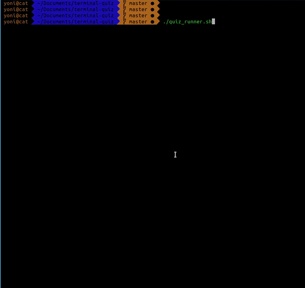

# About

A collection of shell scripts that display random questions in terminal.
The default database contains questions about software development topics - Linux, Command line tools, bash, JavaScript, HTML, CSS, Rails, Angular etc.
But it can also be used for foreign language learning, or anything you want to memorize.

Upon invocation, the runner script queries a custom `sqlite` database for a random question, displays it and gives the user feedback.
The user can choose to continue, and get another question, or to exit the program.

After every response, some basic statistics are displayed and saved to the database.

When a certain question is answered correctly a consecutive number of times, it is considered mastered and won't be selected again for display.




# Prerequisites

* a terminal with `zsh` shell
* `sqlite3`


# Getting started

1. clone this repo to your machine
2. `cd` into the cloned directory
3. add execute permissions: `sudo chmod +x quiz_runner.sh` 
4. run `./quiz_runner.sh`

This should display a random question in the terminal.


# Synopsis

The full command syntax is `./quiz_runner.sh [-d database] [-t topic]`.

The `-d` and `-t` flags are optional, and when invoked without them a random topic question from the default database (that comes with the clone) will be displayed.

You can supply any other database, given that it is structured exactly as described in [DB table description](#db-table-description).


### examples:

* `./quiz_runner.sh` - show random questions from the default database.
* `./quiz_runner.sh -t Ruby` - show random qustions about Ruby from the default database.
* `./quiz_runner.sh -d music.db` - show random questions from `music.db`
* `./quiz_runner.sh -d music.db -t Chords` - show random questions about Chords from the `music.db`.


Note: You should know the topic name in advance. This can be done by running first `utils/db_overview.sh`. This will give you an overview of the content in the database.
Note: if topic name is having several words, enclose it by double quoutes: `./quiz_runner.sh -t "Design Patterns"`.


# DB table description

The default databse, `quiz.db`, is created according to the following schemas:

```sql
CREATE TABLE items(iid integer primary key, stem text not null, ans1 text, ans2 text, ans3 text, ans4 text);
CREATE TABLE keys(iid integer not null, key string not null, foreign key (iid) references items (iid));
CREATE TABLE stats(iid integer not null, attempts integer not null, rights integer not null, streak integer not null, mastered boolean not null, foreign key (iid) references items (iid));
CREATE TABLE domains(did integer primary key, title text not null);
CREATE TABLE items_domains(iid integer not null, did integer not null, foreign key (iid) references items (iid), foreign key (did) references domains (did));
```

These tables are outlined bellow:

### items
* `iid` - item id
* `stem` - the question body, without the answer options
* `ans1` - answer option 1
* `ans2` - answer option 2
* `ans3` - answer option 3
* `ans4` - answer option 4

### keys
* `iid` - item id
* `key` - correct answer index (a|b|c|d)

### stats
* `iid` - item id
* `attemts` - total number of answer attempts
* `rights` - total number of correct answers
* `streak` - number of consecutive correct answers. incremented by 1 upon correct answer; set to 0 otherwise.
* `mastered` - if `streak` reaches predefined threshold (defined as `MASTERED_THRESHOLD` in `quiz_runner.sh`, the question is considered mastered, and won't show again.

### domains
* `did` - domain id
* `title` - domain name

### items_domains
* `iid` - item id
* `did` - domain id


# Ageing algorithm

As you answer questions, basic statistics are collected, such as success rate, streak (consecutive correct answers for the question), etc. As the streak of a question is incremented, the proirity of that question is lowered, in favor of harder questions (with lower streak level). The script fetches a random question with the lowest streak level. This means that you will see the questions you struggle with the most again and again.

This technique makes learning more efficient.


# The utils directory :toolbox:

The utils directory contains utility scripts such as reset all statistics, show the number of questions from each topic, wipe off all db content, etc.
To execute a script form utils:
 
1. add execute permissions: `sudo chmod +x utils/util_name.sh` (where `util_name` is the actual name of the util, as detailed bellow). 
2. run `utils/util_name.sh [options]`


### util scripts

* `db_overview.sh [database]` - print question distrubution by topic in the database
* `reset_stats.sh [database]` - reset all statistics (number of trials, streaks, mastered etc.) 
* `empty_all_tables.sh [database]` - wipe off all database content, leaving only empty tables. USE WITH CAUTION!. THIS OPERATION CANNOT BE UNDONE.
* `dump_to_txt.sh [datababse]` - write all records of `item` table to a txt file named `dump_timestamp.txt` (where `timestamp` is the actual datetime at the moment of creation).
* `db_populator.sh [database]` - populate db tables with content from a formatted questions file. see bellow.
* `create_question_template.sh [number]` - create a `questions.txt` file under main directory, with empty question format. If the optional number is given, it creates this number of empty questions template, as in [Automate new questions upload](#automate-new-questions-upload-robot).


In all scripts above,the `database` parameter is optional, and if invoked without it the script will query the default `quiz.db` that comes with the project.
You can supply any other database, given that it is structured exactly as described in [DB table description](#db-table-description).


# Creating custom database content

If you'd like to replace the content of the default database that comes with the clone, wipe-off all database content, using the `empty_all_tables.sh` from the utils directory, and then popultate the tables with your own content, using the schemas as detailed above.

* note: run the utils script from the main directory, like so: `utils/empty_all_tables.sh`.

# Automate new questions upload :robot:

It is possible to populate all DB tables with questions form a formatted question file. Saving the tedious work of doing it for each question manually with a GUI tool (sqlitebrowser).

To do so, carefully follow the steps bellow.

1. decide in advance how many questions you want to add in a single batch.
2. run `utils/create_question_template.sh [number]`,  where `number` is the number you decided on, in the previous section. This will create a `questions.txt` file under the main project directory, with an empty template. 
2. populate the `questions.txt` file with questions in the following format (see caveats bellow):
```
5
---
sample question body?
---
answer option 1
---
answer option 2
---
answer option 3
---
answer option 4
---
b
###
3
---
another sample question body?
---
answer option 1
---
answer option 2
---
answer option 3
---
answer option 4
---
c
```

In this format, the `###` separtes questions, `---` separates question parts.
For each question, the first line is the domain id, then question body and answer options, separated by `---`. 
The last line of the question is its anwer key (a|b|c|d);


#### caveats:

* the domain id should be known in advance. You can find it by running `utils/db_overview.sh`.
* question body answer options cannot span multiple lines.
* double quotes are not allowed anywhere.

3. With this format followed correctly, the `questions.txt` file is ready for upload. run the following command from the project directory:

```bash
utils/db_populator.sh
```

If not output is displayed, everything executed correctly.


# Features that I may add in the future :sparkles:

* Shuffle answers - anytime a question appears, its answer options are displayed in a random order
* ~~Show questions by topic~~ :heavy_check_mark:
* ~~Enable skipping questions~~ :heavy_check_mark:
* ~~Ageing algorithm - display questions of least success rate, based on streak values~~ :heavy_check_mark:
* ~~Automate db population with new questions from a file~~ :heavy_check_mark:
* ~~Make all scripts db agnostic (pass db as a parameter)~~ :heavy_check_mark:
* ~~Enable flags for invoking the script~~ :heavy_check_mark:
* Write a man page for the script
